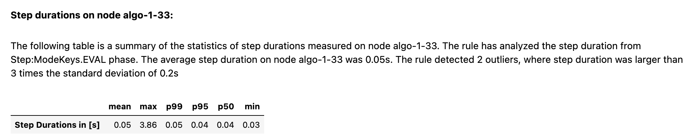

# Inventory Monitoring at Distribution Centers

Distribution centers increasingly rely on automation, including the use of robots to transport items as part of their daily operations. To streamline this process, objects are often grouped and moved in bins, which can contain multiple items. Accurately counting the number of items in each bin is essential for tracking inventory and ensuring that consignments are correct before shipment.

In this project, we develop a machine learning pipeline on AWS to automate the task of counting objects in bins using image data. This system could enhance the efficiency of inventory management in distribution centers by providing an endpoint for item counts in bins.

## How It Works

To build this project:

- AWS SageMaker is used for model training and deployment, allowing for scalable computing resources and efficient data handling.
- End-to-End Pipeline: The project demonstrates end-to-end machine learning engineering skills, from data ingestion and preprocessing to training, deploying, and monitoring a model.

## Model and Pipeline Design
For the classification task, we use a pre-trained convolutional neural network (CNN) architecture, ResNet50, and fine-tune it on the Amazon Bin Image Dataset to predict object counts. By leveraging AWS SageMaker, we automate and scale the training, deployment, and monitoring of this model in a robust cloud-based infrastructure.

## Project Set Up

This project primarily uses the AWS SageMaker service for model training and deployment. The data is based on a subset list provided by the Udacity project [repo](https://github.com/udacity/nd009t-capstone-starter/tree/master/starter) and is sourced from the Amazon Bin Image Dataset. Please refer to that repository for more information on setup.

## Dataset

### Overview
The project leverages the Amazon Bin Image Dataset, which includes 500,000 images of bins containing varying numbers of objects. To manage SageMaker credit usage, we downloaded a subset of the data, as provided by Udacity, totaling around 10,441 images. The number of objects serves as the label or class for our classification task, and our dataset includes counts ranging from 1 to 5.

### Access
A subset of images from the Amazon Bin Image Dataset is downloaded using a predefined metadata list. The script first reads that list file containing paths to selected images. Using the `boto3` library, each image is downloaded from an S3 bucket. The dataset is then split into training, validation, and testing sets by class to ensure balanced representation in each subset.

## Model Training
In this experiment, we chose a `pretrained ResNet50` model architecture, which is known for its efficiency in image classification tasks due to its depth and skip connections. This architecture provides a strong foundation for visual feature extraction, allowing us to fine-tune it for our specific task of counting objects in bins. The final layer of ResNet50 was replaced with a fully connected layer to classify images into five classes, representing the count of objects in each bin.

### Hyperparameters

We used **SageMaker’s Hyperparameter Tuning** feature to optimize the key hyperparameters affecting model performance. The selected hyperparameters include:

- Learning Rate: A continuous range between `0.001` and `0.1` was chosen to explore a broad spectrum. This parameter directly impacts the speed and stability of training.
- Batch Size: We tested discrete values `(32, 64, 128, 256, and 512)` to balance between memory efficiency and gradient stability.
- Epochs : A range of `10 to 40` was set to find an optimal training duration that avoids both overfitting and underfitting.

The objective metric for tuning was to minimize **Validation Loss**, and after running five tuning jobs sequentially, the best hyperparameters identified were:

- Batch Size: 32
- Epochs: 21
- Learning Rate: 0.0023

## Machine Learning Pipeline
The project's pipeline includes data processing, model training, tuning, deployment, and inference, as follows:

### 1. Data Ingestion and Preprocessing

Using a subset of the Amazon Bin Image Dataset, we split the data into training, validation, and test sets with a stratified approach to maintain balanced class distribution.

### 2. Uploading Data to S3

The data is uploaded to S3 for efficient access by SageMaker during model training.
### 3. Model Training and Hyperparameter Tuning

We fine-tune a pretrained ResNet50 model using SageMaker’s `HyperparameterTuner` to optimize learning rate, batch size, and epochs. The best hyperparameters (batch size: 32, epochs: 21, learning rate: 0.0023) improve model accuracy.
SageMaker `Debugger` and `Profiler` monitor the training process to track losses and performance metrics.
### 4. Model Deployment

The trained model is deployed to a SageMaker endpoint configured for real-time inference, accepting JPEG images and returning JSON predictions.
### 5. Prediction and Testing

Sample images are sent to the endpoint to verify accuracy. The custom `ImagePredictor` class handles image serialization and deserialization for seamless endpoint interaction.

## Standout Suggestions Implementation

### Hyperparameter Tuning
The hyperparameter tuning job was conducted on AWS SageMaker. The following key hyperparameters were selected for tuning:
- Learning Rate (lr): Range of 0.001 to 0.1, enabling exploration of various learning rates for convergence speed and stability.
- Batch Size: Options included 32, 64, 128, 256, and 512, balancing memory efficiency and gradient stability.
- Epochs: Set between 10 to 40 to assess optimal training duration without overfitting or underfitting.

The tuning objective was to minimize Validation Loss, parsed directly from training logs. Five jobs were executed sequentially, and the best configuration achieved a validation loss of 1.32 with the following settings:
- Batch Size: 32
- Epochs: 21
- Learning Rate: 0.0023

This configuration resulted in improved validation accuracy and generalization of the model, as demonstrated by the completion statuses and metric results from the SageMaker tuning job dashboard.

### Model Deployment
The trained model is deployed to a SageMaker endpoint configured for real-time inference, accepting JPEG images and returning JSON predictions. The endpoint screenshot:

Inference result for an image with 3 objects:

### Model Profiling and Debugging
To ensure efficient model training, we used AWS SageMaker Debugger for profiling and debugging. This allowed us to monitor training performance, analyze resource utilization, and address potential bottlenecks.

#### Profiling Setup

We configured SageMaker with various debugging rules, including checks for: `Vanishing Gradients`, `Overfitting`, `Overtraining`, `Poor Weight Initialization`, `Loss Not Decreasing`, `Low GPU Utilization`.

Additionally, a custom Profiler Report was generated to analyze the system and framework metrics in detail. 

#### Key Findings
- Low GPU Utilization: The profiler flagged instances of low GPU utilization, indicating that batch size could be increased or other optimizations applied.
- Step Outliers: Some step durations varied significantly, which suggests possible system bottlenecks.

#### Visualization
We utilized Amazon SageMaker’s `SMDebug` library for model debugging and profiling to monitor training performance, record key metrics, and plot learning curves. The chart below illustrates Training and Validation Loss Over Steps, providing insights into model convergence and helping to identify any issues with loss during training.

